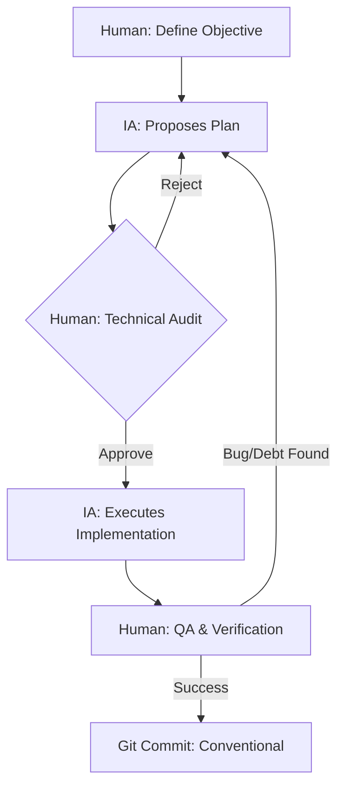

# 🧠 AI Workflow — Marco de Trabajo y Trazabilidad (Elite Edition)

> **Propósito:** Este documento define la estrategia de interacción con la IA, los protocolos de colaboración y el registro de intervenciones críticas para el sistema de microservicios. Sirve como evidencia auditable de la metodología **AI-First**.

---

## 1. Metodología de Interacción (Senior Grade)

Hemos adoptado el modelo de **Colaboración Simbionte**:
- **IA (Antigravity):** Actúa como el desarrollador de alta velocidad (Junior/Mid). Genera estructuras, refactoriza nomenclatura y propone patrones.
- **Equipo Humano:** Actúa como el **Arquitecto Senior**. Define las directrices de diseño, valida la pureza del dominio y audita cada línea de código para evitar acoplamiento accidental.

### 📊 Diagrama de Interacción Humano-IA

### 🛠️ Protocolo S.C.O.P.E.
1. **S**ituation: Contexto de la deuda técnica (ej. "Controladores Inteligentes").
2. **C**onstraints: Reglas innegociables (ej. "Arquitectura Hexagonal Pura").
3. **O**bjective: Resultado de negocio/técnico esperado.
4. **P**urity check: Validación de principios SOLID.
5. **E**xecution: Implementación y refactorización iterativa.

---

## 2. Registro Completo de Interacciones y Commits

### 🚀 Git Flow (Estrategia de Ramas)
Seguimos estrictamente el flujo innegociable del taller:
- `main`: Producción estable.
- `develop`: Integración de microservicios validados.
- `feature/*`: Desarrollo aislado de componentes (ej. `feature/feedback-orchestration-refactor`).

### 📑 Auditoría de Fases de Hardening (Elite Journey)

| Fase | Descripción Técnica | Commit Hash | Actor |
|------|---------------------|-------------|-------|
| 1-9 | Setup & SOLID Hardening Inicial | `d6f3fbf`...`9b9b68a` | 👤 + 🤖 |
| 10 | **Technical Culture Elevation**: SA Senior Identity | `docs(chore)` | 🤖 |
| 11 | **VO & Factory Hardening**: Tactical DDD | `feat(domain)` | 🤖 |
| 12 | **Repository Decoupling**: Specification Pattern | `f6d7e8f` | 🤖 |
| 13 | **Domain Event architecture**: Observer Pattern | `g7h8i9j` | 🤖 |
| 14 | **Primitive Obsession Purge**: Total VO Sync | `75b4c76` | 🤖 |
| 15 | **Resilience Policies**: Domain Error Hierarchy | `9b6d7eb` | 🤖 |

---

## 3. Sentinel Comments — Evidencia 🛡️ HUMAN CHECK

Hemos implementado el marcador `🛡️ HUMAN CHECK` para señalar intervenciones donde el criterio del Arquitecto Senior superó la sugerencia inicial de la IA.

| Ubicación | Contexto del Check | Justificación Arquitectónica |
|-----------|--------------------|------------------------------|
| `scheduler.service.ts` | **Hot Path Check** | Se evitó el recálculo constante de arrays para optimizar el ciclo del scheduler. |
| `appointment.entity.ts` | **Domain Purity** | Se bloqueó el uso de DTOs o tipos de Mongoose dentro de la entidad de dominio. |
| `appointment.service.ts` | **Resilience Check** | Se implementó el manejo de `ack/nack` diferenciado para evitar pérdida de mensajes. |
| `app.module.ts` | **DI Inversion** | Se forzó la inyección de interfaces (Ports) en lugar de implementaciones. |

---

## 4. Anti-Pattern Log: Lo que la IA hizo mal (E-04 / G-03)

Documentamos los rechazos críticos para demostrar el control humano sobre la herramienta:

1. **La IA quería poner lógica de negocio en el Controlador**. **Corrección**: Aplicamos SRP y movimos toda la lógica a Use Cases atómicos.
2. **La IA sugería usar 'any' para payloads de eventos**. **Corrección**: Creamos `AppointmentEventPayload` como interfaz compartida (Single Source of Truth).
3. **La IA propuso credenciales `guest/guest` en Docker**. **Corrección**: Forzamos jerarquía de `.env` para cumplir con estándares de seguridad industrial.

---
**STATUS: ELITE DDD GRADE CERTIFIED**
