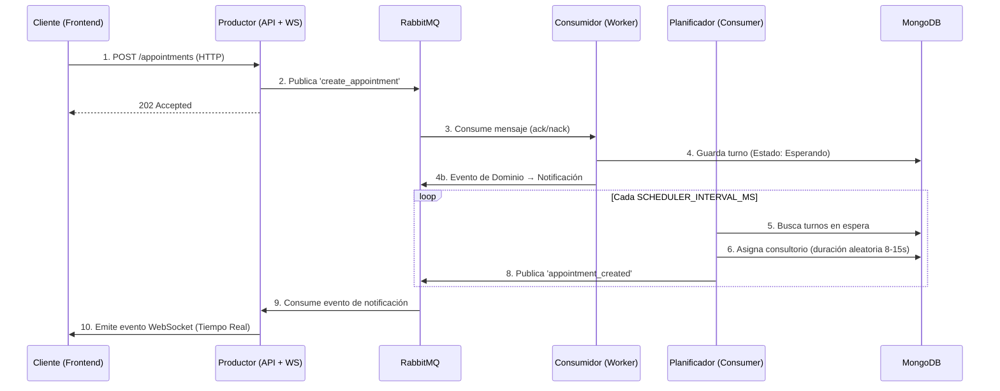

# IA_P1 - Sistema de Turnos Médicos en Tiempo Real

> **Sistema de gestión de citas médicas certificado con "Elite DDD" y "Arquitectura Hexagonal".**
> Construido con NestJS, RabbitMQ, MongoDB y Next.js.

## 1. Arquitectura del sistema

La arquitectura central desacopla la recepción de turnos del procesamiento utilizando un patrón de **Microservicios Orientados a Eventos**.



## 2. Documentacion del proyecto

La documentación activa del proyecto se concentra en los artefactos técnicos y funcionales necesarios para mantener, desplegar y validar la solución.

| Documento                   | Descripción                                            | Ubicación                                                        |
| --------------------------- | ------------------------------------------------------ | ---------------------------------------------------------------- |
| **Arquitectura**            | Decisiones arquitectónicas y ADRs del sistema.         | [**docs/architecture/README.md**](./docs/architecture/README.md) |
| **Auditoría de Seguridad**  | Hallazgos y recomendaciones de seguridad.              | [**SECURITY_AUDIT.md**](./SECURITY_AUDIT.md)                     |
| **Resumen de Pruebas**      | Evidencia de cobertura y validación funcional.         | [**TESTING_SUMMARY.md**](./TESTING_SUMMARY.md)                   |
| **Guía de estilo Markdown** | Reglas editoriales para documentación del repositorio. | [**docs/MD_STYLE_GUIDE.md**](./docs/MD_STYLE_GUIDE.md)           |

### Reportes de Estado

- **Auditoría de Seguridad:** [SECURITY_AUDIT.md](./SECURITY_AUDIT.md)
- **Pruebas y Validación:** [TESTING_SUMMARY.md](./TESTING_SUMMARY.md)

---

## 3. Inicio rapido

### Prerrequisitos

- Docker Engine & Docker Compose v2 **o** Podman + Podman Compose

### Pasos

1. **Clonar el repositorio**

   ```bash
   git clone https://github.com/jhorman10/IA_P1_Fork.git
   cd IA_P1_Fork
   ```

2. **Configurar entorno**

   ```bash
   cp .env.example .env
   # Editar .env con credenciales seguras (ver .env.example para detalles)
   ```

3. **Iniciar infraestructura**
   - **Con Docker Compose:**
     ```bash
     docker compose up -d --build
     ```
   - **Con Podman Compose:**
     ```bash
     podman-compose up -d --build
     ```
     > **Nota:**
     >
     > - Podman Compose es compatible con este archivo, pero revisa advertencias sobre volúmenes y puertos si usas rootless Podman.
     > - Si encuentras problemas con permisos en volúmenes, consulta la [documentación oficial de Podman](https://docs.podman.io/en/latest/markdown/podman-compose.1.html).

4. **Acceder a la aplicación**
   - **Frontend:** [http://localhost:3001](http://localhost:3001)
   - **API Swagger:** [http://localhost:3000/api/docs](http://localhost:3000/api/docs)
   - **RabbitMQ Admin:** [http://localhost:15672](http://localhost:15672)

---

## 4. Caracteristicas clave

- **Orientado a Eventos**: Comunicación puramente asíncrona vía RabbitMQ.
- **Diseño Guiado por el Dominio (DDD)**: Value Objects, Eventos de Dominio, Fábricas, Especificaciones.
- **Arquitectura Hexagonal**: Patrón de Puertos y Adaptadores en el servicio Consumidor.
- **Tiempo Real**: WebSockets para actualizaciones instantáneas de turnos.
- **Resiliencia**: DLQ (Dead Letter Queue), Políticas de Reintento y Healthchecks.
- **Seguridad**: Helmet, Rate Limiting, CORS y Política de Cero Hardcodeo.
