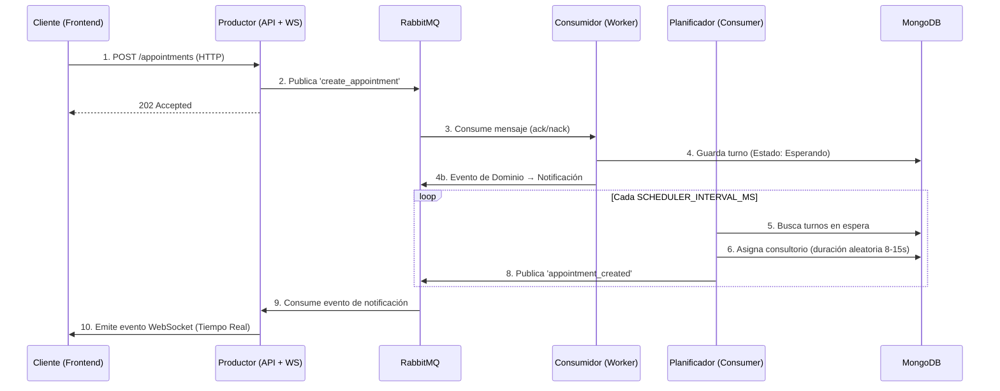

# IA_P1 - Sistema de Turnos Médicos en Tiempo Real

> **Sistema de gestión de citas médicas certificado con "Elite DDD" y "Arquitectura Hexagonal".**
> Construido con NestJS, RabbitMQ, MongoDB y Next.js.

## 🚀 Arquitectura del Sistema

La arquitectura central desacopla la recepción de turnos del procesamiento utilizando un patrón de **Microservicios Orientados a Eventos**.



## 📚 Documentación y Contexto del Proyecto

Este proyecto utiliza una "Meta-Arquitectura" modular donde la documentación es la Fuente Única de Verdad tanto para humanos como para agentes de IA.

| Módulo | Descripción | Ubicación |
|--------|-------------|-----------|
| **🏗️ Contexto del Proyecto** | Arquitectura, Stack Tecnológico, Estructura de Carpetas. | [**PROJECT_CONTEXT.md**](./docs/agent-context/PROJECT_CONTEXT.md) |
| **⚖️ Reglas y Directrices** | Convenciones culturales, Anti-patrones, Higiene. | [**RULES.md**](./docs/agent-context/RULES.md) |
| **🔄 Motor de Flujo** | Protocolos de interacción, trazabilidad y modelo de delegación. | [**WORKFLOW.md**](./docs/agent-context/WORKFLOW.md) |
| **🛠️ Registro de Skills** | Capacidades disponibles para el Orquestador de IA. | [**SKILL_REGISTRY.md**](./docs/agent-context/SKILL_REGISTRY.md) |

### Reportes de Estado
- **Deuda Técnica:** [DEBT_REPORT.md](./DEBT_REPORT.md) (Estado: **ELITE GRADE**)
- **Auditoría de Seguridad:** [SECURITY_AUDIT.md](./SECURITY_AUDIT.md)
- **Trazabilidad IA:** [AI_WORKFLOW.md](./AI_WORKFLOW.md)

---

## 🛠️ Inicio Rápido


### Prerrequisitos
- Docker Engine & Docker Compose v2 **o** Podman + Podman Compose

### Pasos

1. **Clonar el repositorio**
   ```bash
   git clone https://github.com/jhorman10/IA_P1_Fork.git
   cd IA_P1_Fork
   ```

2. **Configurar entorno**
   ```bash
   cp .env.example .env
   # Editar .env con credenciales seguras (ver .env.example para detalles)
   ```


3. **Iniciar infraestructura**
    - **Con Docker Compose:**
       ```bash
       docker compose up -d --build
       ```
    - **Con Podman Compose:**
       ```bash
       podman-compose up -d --build
       ```
       > ⚠️ **Nota:**
       > - Podman Compose es compatible con este archivo, pero revisa advertencias sobre volúmenes y puertos si usas rootless Podman.
       > - Si encuentras problemas con permisos en volúmenes, consulta la [documentación oficial de Podman](https://docs.podman.io/en/latest/markdown/podman-compose.1.html).

4. **Acceder a la aplicación**
   - **Frontend:** [http://localhost:3001](http://localhost:3001)
   - **API Swagger:** [http://localhost:3000/api/docs](http://localhost:3000/api/docs)
   - **RabbitMQ Admin:** [http://localhost:15672](http://localhost:15672)

---

## ✨ Características Clave

- **Orientado a Eventos**: Comunicación puramente asíncrona vía RabbitMQ.
- **Diseño Guiado por el Dominio (DDD)**: Value Objects, Eventos de Dominio, Fábricas, Especificaciones.
- **Arquitectura Hexagonal**: Patrón de Puertos y Adaptadores en el servicio Consumidor.
- **Tiempo Real**: WebSockets para actualizaciones instantáneas de turnos.
- **Resiliencia**: DLQ (Dead Letter Queue), Políticas de Reintento y Healthchecks.
- **Seguridad**: Helmet, Rate Limiting, CORS y Política de Cero Hardcodeo.

---
**ESTADO: PUREZA ARQUITECTÓNICA ALCANZADA** ✅
