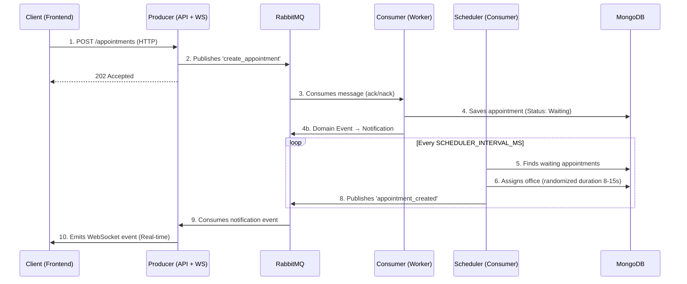

# IA_P1 - Real-Time Medical Appointment System

> **Medical appointment management system certified for "Elite DDD" & "Hexagonal Architecture".**
> Built with NestJS, RabbitMQ, MongoDB, and Next.js.

## 🚀 System Architecture

The core architecture decouples appointment reception from processing using an **Event-Driven Microservices** pattern.



## 📚 Documentation & Project Context

This project uses a modular "Meta-Architecture" where documentation is the Single Source of Truth for both humans and AI agents.

| Module | Description | Location |
|--------|-------------|----------|
| **🏗️ Project Context** | Architecture, Tech Stack, Folder Structure, Services definition. | [**PROJECT_CONTEXT.md**](./docs/agent-context/PROJECT_CONTEXT.md) |
| **⚖️ Rules & Guidelines** | Cultural conventions, Anti-patterns, Hygiene rules. | [**RULES.md**](./docs/agent-context/RULES.md) |
| **🔄 Workflow Engine** | Interaction protocols, traceability, and delegation model. | [**WORKFLOW.md**](./docs/agent-context/WORKFLOW.md) |
| **🛠️ Skill Registry** | Capabilities available to the AI Orchestrator (Auto-synced). | [**SKILL_REGISTRY.md**](./docs/agent-context/SKILL_REGISTRY.md) |

### Status Reports
- **Technical Debt:** [DEBT_REPORT.md](./DEBT_REPORT.md) (Status: **ELITE GRADE**)
- **Security Audit:** [SECURITY_AUDIT.md](./SECURITY_AUDIT.md)
- **AI Traceability:** [AI_WORKFLOW.md](./AI_WORKFLOW.md)

---

## 🛠️ Quick Start

### Prerequisites
- Docker Engine & Docker Compose v2

### Steps

1. **Clone the repository**
   ```bash
   git clone https://github.com/jhorman10/IA_P1_Fork.git
   cd IA_P1_Fork
   ```

2. **Configure environment**
   ```bash
   cp .env.example .env
   # Edit .env with secure credentials (see .env.example for details)
   ```

3. **Start the infrastructure**
   ```bash
   docker compose up -d --build
   ```

4. **Access the application**
   - **Frontend:** [http://localhost:3001](http://localhost:3001)
   - **API Swagger:** [http://localhost:3000/api/docs](http://localhost:3000/api/docs)
   - **RabbitMQ Admin:** [http://localhost:15672](http://localhost:15672)

---

## ✨ Key Features

- **Event-Driven**: Pure async communication via RabbitMQ.
- **Domain-Driven Design (DDD)**: Value Objects, Domain Events, Factories, Specifications.
- **Hexagonal Architecture**: Ports & Adapters pattern in Consumer service.
- **Real-Time**: WebSockets for instant appointment updates.
- **Resilience**: DLQ (Dead Letter Queue), Retry Policies, and Healthchecks.
- **Security**: Helmet, Rate Limiting, CORS, and Zero-Hardcode Policy.

---
**STATUS: ARCHITECTURAL PURITY ACHIEVED** ✅
