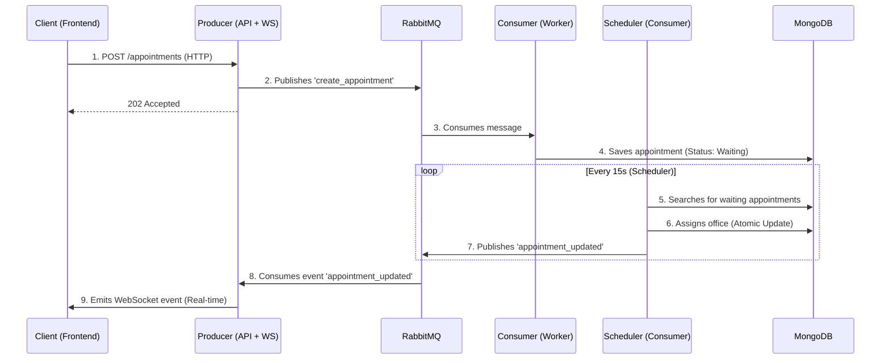

# IA_P1 - Real-Time Medical Appointment System

> Medical appointment management system based on **Microservices**, **Event-Driven Architecture**, and **WebSockets**.

## 🚀 Architecture and Flow

The system decouples appointment reception from processing to ensure high availability and scalability.



## 🧩 Services

| Service | Technology | Port | Responsibility |
|---|---|---|---|
| **Producer** | NestJS | `3000` | API Gateway, Input Validation, WebSocket Gateway, Swagger Documentation. |
| **Consumer** | NestJS | — | Async processing, Assignment Scheduler, DB Persistence. |
| **Frontend** | Next.js | `3001` | Reactive User Interface, WebSocket Client, Modern Design. |
| **RabbitMQ** | RabbitMQ 3 | `5672` | Messaging Broker (Queues: `turnos_queue`, `turnos_notifications`). |
| **MongoDB** | MongoDB 7 | `27017` | Persistent NoSQL Database. |

## 🛠️ Installation and Execution

### Prerequisites
- Docker Engine & Docker Compose

### Steps

1. **Clone the repository**
   ```bash
   git clone https://github.com/Duver0/IA_P1.git
   cd IA_P1
   ```

2. **Start the infrastructure**
   ```bash
   docker compose up -d --build
   ```

3. **Access the application**
   - **Frontend:** [http://localhost:3001](http://localhost:3001)
   - **API Swagger:** [http://localhost:3000/api/docs](http://localhost:3000/api/docs)
   - **RabbitMQ Admin:** [http://localhost:15672](http://localhost:15672) (user: `guest`, pass: `guest`)

## ✨ Key Features

- **Event-Driven**: Asynchronous communication between services for better resilience.
- **Real-Time**: Instant updates on the frontend via WebSockets (`socket.io`).
- **Concurrency Safe**: Atomic appointment assignment (`findOneAndUpdate`) to prevent race conditions.
- **Robustness**:
  - Typed error handling (`AppointmentEventPayload`).
  - Data validation (DTOs + `class-validator`).
  - Structured logs (`NestJS Logger`).
- **Infrastructure as Code**: Fully dockerized environment (`docker-compose.yml`).

## 📡 API Endpoints (Producer)

| Method | Endpoint | Description |
|---|---|---|
| `POST` | `/appointments` | Create a new appointment (Async) |
| `GET` | `/appointments` | List all appointments |
| `GET` | `/appointments/:idCard` | Search appointments by ID card |

## 🧪 Manual Testing (cURL)

**Create an appointment:**
```bash
curl -X POST http://localhost:3000/appointments \
  -H "Content-Type: application/json" \
  -d '{"fullName": "Test Patient", "idCard": 12345, "priority": "high"}'
```

**View response:**
```json
{
  "status": "accepted",
  "message": "Appointment assignment in progress"
}
```

## 📂 Project Structure

```
IA_P1/
├── backend/
│   ├── producer/        # API Gateway & WebSocket Server
│   │   ├── src/events/  # Event controllers (RabbitMQ -> WS)
│   │   └── src/turnos/  # HTTP business logic
│   └── consumer/        # Worker Service
│       ├── src/scheduler/ # Auto-assignment logic
│       └── src/turnos/    # MongoDB persistence
├── frontend/            # Next.js App Router
│   ├── src/hooks/       # Custom Hooks (useAppointmentsWebSocket)
│   └── src/domain/      # Shared models
├── docker-compose.yml   # Container orchestration
└── README.md            # Documentation
```

## 📝 Documentation & AI Strategy

Este proyecto sigue una metodología **AI-First**. Para entender nuestro marco de trabajo, protocolos de interacción y la trazabilidad completa del desarrollo, consulte:
👉 [**AI_WORKFLOW.md**](./AI_WORKFLOW.md)

## ⚠️ Lo que la IA hizo mal (Anti-Pattern Log)

Siguiendo las directrices del taller, documentamos casos donde la IA propuso soluciones que fueron corregidas por el equipo humano:

1. **Acoplamiento de Infraestructura (SRP Violation)**:
   - **Propuesta IA**: La IA inicialmente sugirió manejar los acuses de recibo (ack/nack) y el envío de notificaciones WS directamente en el `ConsumerController`.
   - **Rechazo Humano**: Esto convertía al controlador en un "God Object" acoplado a RabbitMQ y Socket.IO. Forzamos la creación de una **Capa de Aplicación (Use Cases)** y **Puertos de Salida**, delegando la infraestructura a adaptadores específicos.

2. **Seguridad y Docker (DIP Violation)**:
   - **Propuesta IA**: En las primeras versiones de `docker-compose.yml`, la IA generó el broker de RabbitMQ y la base de datos MongoDB sin variables de entorno para credenciales (usando `guest/guest`).
   - **Rechazo Humano**: Vulnerabilidad crítica. Se obligó a la IA a implementar una jerarquía de `.env` y `.env.example`, además de configurar healthchecks para asegurar la resiliencia del orquestador.

3. **Hot Path Optimization**:
   - **Propuesta IA**: El scheduler recalculaba la lista de consultorios disponibles en cada tick de ejecución.
   - **Rechazo Humano**: Degradación innecesaria de performance. Movimos el precálculo a la fase de instanciación del servicio para mantener la eficiencia del "path caliente".

---
**ESTADO: ARQUITECTURA "ELITE DDD" ALCANZADA**
