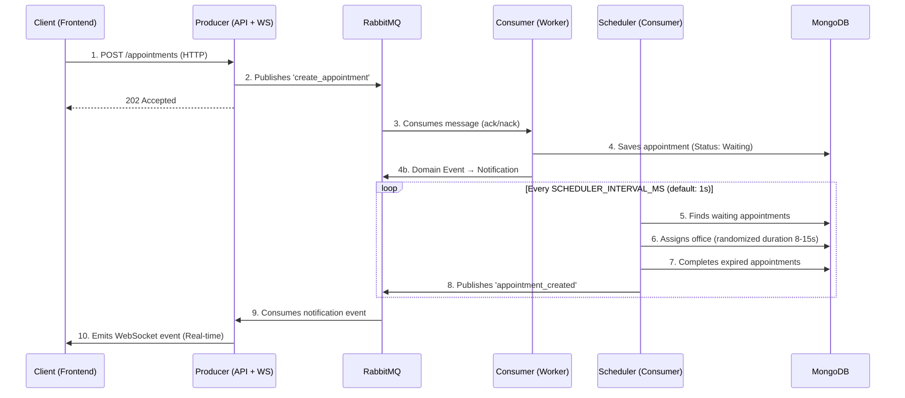

# IA_P1 - Real-Time Medical Appointment System

> Medical appointment management system based on **Microservices**, **Event-Driven Architecture**, **Domain-Driven Design (DDD)**, and **WebSockets**.

## 🚀 Architecture and Flow

The system decouples appointment reception from processing using an **Event-Driven Microservices** pattern with **Hexagonal Architecture** in the Consumer.



## 🧩 Services

| Service | Technology | Port | Responsibility |
|---|---|---|---|
| **Producer** | NestJS 10 | `3000` | API Gateway, Input Validation, WebSocket Gateway, Swagger, Security Headers (Helmet), Rate Limiting (Throttler). |
| **Consumer** | NestJS 10 | — | Async processing, Hexagonal Architecture (Use Cases, Ports, Adapters), Assignment Scheduler, MongoDB Persistence, Domain Events. |
| **Frontend** | Next.js 15 | `3001` | App Router UI, WebSocket Client (`socket.io`), CSS Modules. |
| **RabbitMQ** | 3-management | `5672` / `15672` | Message Broker. Queues: `turnos_queue` (with DLX), `turnos_notifications`. |
| **MongoDB** | 7 | `27017` | Persistent NoSQL Database (Mongoose ODM). |

## 🛠️ Installation and Execution

### Prerequisites
- Docker Engine & Docker Compose v2

### Steps

1. **Clone the repository**
   ```bash
   git clone https://github.com/jhorman10/IA_P1_Fork.git
   cd IA_P1_Fork
   ```

2. **Configure environment**
   ```bash
   cp .env.example .env
   # Edit .env with secure credentials for production
   ```

3. **Start the infrastructure**
   ```bash
   docker compose up -d --build
   ```

4. **Access the application**
   - **Frontend:** [http://localhost:3001](http://localhost:3001)
   - **API Swagger:** [http://localhost:3000/api/docs](http://localhost:3000/api/docs)
   - **RabbitMQ Admin:** [http://localhost:15672](http://localhost:15672)

## 🔐 Security Hardening

| Feature | Description |
|---------|-------------|
| **Helmet** | HTTP security headers (XSS, Clickjacking, MIME sniffing protection). |
| **Throttler** | Global rate limiting: 10 requests per 60 seconds. |
| **WsAuthGuard** | WebSocket authentication guard on the appointments gateway. |
| **Restricted CORS** | Origin limited to `FRONTEND_URL` environment variable. |
| **Zero Hardcode Policy** | All credentials, URIs, and queue names come from environment variables only. |
| **DLX (Dead Letter Exchange)** | Failed messages after 2 retries are routed to `appointment_dlq` for forensic analysis. |

## ✨ Key Features

- **Event-Driven**: Asynchronous communication between services via RabbitMQ for high resilience.
- **Domain-Driven Design (DDD)**: Consumer implements Value Objects (`IdCard`, `FullName`, `Priority`), Domain Events, Factories, and Specifications.
- **Hexagonal Architecture**: Consumer uses Ports & Adapters pattern — domain logic is fully decoupled from infrastructure.
- **Real-Time**: Instant updates on the frontend via WebSockets (`socket.io`).
- **Concurrency Safe**: Atomic appointment assignment (`findOneAndUpdate`) to prevent race conditions.
- **Resilience**: Structured retry policy with `ack/nack` and Dead Letter Queue for failed messages.
- **Idempotency**: Duplicate appointment detection by `idCard` to prevent re-registration.
- **Validation**: Typed DTOs with `class-validator` decorators and `whitelist: true`.
- **Infrastructure as Code**: Fully dockerized environment with healthchecks on all services.

## 📡 API Endpoints (Producer)

| Method | Endpoint | Description |
|---|---|---|
| `POST` | `/appointments` | Create a new appointment (Async, returns `202 Accepted`) |
| `GET` | `/appointments` | List all appointments |
| `GET` | `/appointments/:idCard` | Search appointments by patient ID card |
| `GET` | `/health` | Service health check |

### Create Appointment DTO

| Field | Type | Required | Description |
|-------|------|----------|-------------|
| `idCard` | `number` | ✅ | Patient ID card (positive integer) |
| `fullName` | `string` | ✅ | Patient full name |
| `priority` | `string` | ❌ | `high`, `medium` (default), or `low` |

## 🧪 Manual Testing (cURL)

**Create an appointment:**
```bash
curl -X POST http://localhost:3000/appointments \
  -H "Content-Type: application/json" \
  -d '{"fullName": "Test Patient", "idCard": 12345, "priority": "high"}'
```

**Response (`202 Accepted`):**
```json
{
  "status": "accepted",
  "message": "Appointment assignment in progress"
}
```

**Query by ID card:**
```bash
curl http://localhost:3000/appointments/12345
```

## 📂 Project Structure

```
IA_P1_Fork/
├── backend/
│   ├── producer/                    # API Gateway & WebSocket Server
│   │   ├── src/
│   │   │   ├── common/guards/       # WsAuthGuard (WebSocket security)
│   │   │   ├── dto/                 # CreateAppointmentDto (class-validator)
│   │   │   ├── events/              # WebSocket Gateway & RMQ event listeners
│   │   │   ├── infrastructure/      # RabbitMQ Publisher Adapter (Port)
│   │   │   ├── schemas/             # Mongoose schemas (read-only)
│   │   │   ├── producer.controller  # REST API Controller
│   │   │   └── main.ts              # Bootstrap (Helmet, CORS, Swagger, Hybrid)
│   │   └── Dockerfile
│   └── consumer/                    # Worker Service (Hexagonal Architecture)
│       ├── src/
│       │   ├── domain/              # 🏛️ Core Domain Layer
│       │   │   ├── entities/        #   Appointment Entity
│       │   │   ├── value-objects/    #   IdCard, FullName, Priority
│       │   │   ├── events/          #   AppointmentRegistered, AppointmentAssigned
│       │   │   ├── factories/       #   AppointmentFactory
│       │   │   ├── ports/           #   Inbound (Use Cases) & Outbound (Repos, Logger)
│       │   │   ├── specifications/  #   Query specifications
│       │   │   └── errors/          #   ValidationError, DomainError
│       │   ├── application/         # 🎯 Application Layer
│       │   │   ├── use-cases/       #   Register, Assign, Complete, Orchestrate
│       │   │   └── event-handlers/  #   AppointmentEventsHandler
│       │   ├── infrastructure/      # 🔌 Infrastructure Layer
│       │   │   ├── persistence/     #   MongooseAppointmentRepository, Mapper
│       │   │   ├── adapters/        #   RmqNotificationAdapter
│       │   │   ├── messaging/       #   LocalDomainEventBusAdapter
│       │   │   ├── logging/         #   NestLoggerAdapter
│       │   │   └── utils/           #   SystemClockAdapter
│       │   ├── scheduler/           # ⏱️ Scheduler Service (configurable interval)
│       │   └── notifications/       # 📩 RMQ notification client
│       └── Dockerfile
├── frontend/                        # Next.js 15 App Router
│   └── src/
│       ├── app/                     # Pages (App Router)
│       ├── components/              # UI Components
│       ├── hooks/                   # useAppointmentsWebSocket
│       ├── domain/                  # Shared models
│       ├── repositories/            # API client
│       └── styles/                  # CSS Modules
├── skills/                          # AI Agent Skills (backend-api, testing-qa, etc.)
├── docker-compose.yml               # Container orchestration (5 services)
├── .env.example                     # Environment variable template
├── GEMINI.md                        # AI Orchestrator configuration
├── AI_WORKFLOW.md                   # Human-AI collaboration methodology
├── SECURITY_AUDIT.md                # Security audit report
├── DEBT_REPORT.md                   # Technical debt tracking
└── README.md                        # This file
```

## ⚙️ Environment Variables

| Variable | Default | Description |
|----------|---------|-------------|
| `PRODUCER_PORT` | `3000` | Producer HTTP port |
| `FRONTEND_PORT` | `3001` | Frontend port |
| `FRONTEND_URL` | `http://localhost:3001` | Allowed CORS origin |
| `RABBITMQ_USER` | `guest` | RabbitMQ username |
| `RABBITMQ_PASS` | `guest` | RabbitMQ password |
| `RABBITMQ_QUEUE` | `turnos_queue` | Main appointment queue |
| `RABBITMQ_NOTIFICATIONS_QUEUE` | `turnos_notifications` | WebSocket bridge queue |
| `RABBITMQ_PORT` | `5672` | RabbitMQ AMQP port |
| `RABBITMQ_MGMT_PORT` | `15672` | RabbitMQ Management UI port |
| `MONGO_USER` | `admin` | MongoDB username |
| `MONGO_PASS` | `admin123` | MongoDB password |
| `MONGODB_PORT` | `27017` | MongoDB port |
| `SCHEDULER_INTERVAL_MS` | `1000` | Scheduler tick interval (ms) |
| `CONSULTORIOS_TOTAL` | `5` | Total number of available offices |

> ⚠️ **Do not use default credentials in production.** Configure secure values in your `.env` file.

## 📝 Documentation & AI Strategy

This project follows an **AI-First** methodology. For the complete framework, interaction protocols, and development traceability, see:
👉 [**AI_WORKFLOW.md**](./AI_WORKFLOW.md)

## ⚠️ What the AI Did Wrong (Anti-Pattern Log)

Following workshop guidelines, we document cases where the AI proposed solutions that were corrected by the human team:

1. **Infrastructure Coupling (SRP Violation)**:
   - **AI Proposal**: The AI initially suggested handling ack/nack and WebSocket notifications directly in the `ConsumerController`.
   - **Human Rejection**: This turned the controller into a "God Object" coupled to RabbitMQ and Socket.IO. We forced the creation of an **Application Layer (Use Cases)** and **Outbound Ports**, delegating infrastructure to specific adapters.

2. **Security and Docker (DIP Violation)**:
   - **AI Proposal**: Early `docker-compose.yml` versions had RabbitMQ and MongoDB without environment variables for credentials (using `guest/guest`).
   - **Human Rejection**: Critical vulnerability. We enforced a `.env` / `.env.example` hierarchy, plus healthchecks for orchestration resilience.

3. **Hot Path Optimization**:
   - **AI Proposal**: The scheduler recalculated the list of available offices on every tick.
   - **Human Rejection**: Unnecessary performance degradation. We moved the pre-calculation to the service instantiation phase to keep the "hot path" efficient.

---
**STATUS: "ELITE DDD" ARCHITECTURE + SECURITY HARDENING ACHIEVED** ✅
