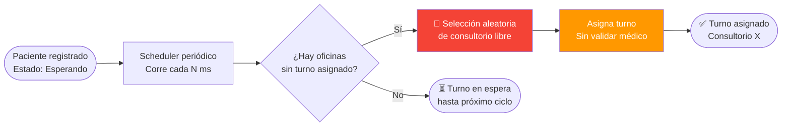
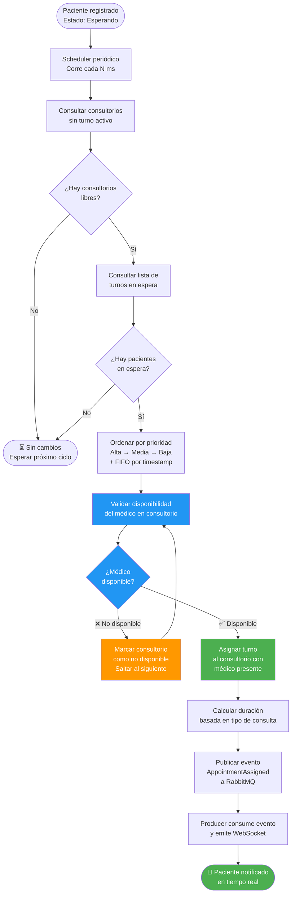

# CHANGELOG_SOURCES — Bitácora de Investigación IA vs Humano

> **Feature:** Sistema de asignación de médicos disponibles a pacientes  
> **Autor:** Jhorman Orozco  
> **Semana:** 6 — Vuelo | Taller: Ingeniería de Software Core  
> **Restricción activa:** Zero Code — Solo diseño arquitectónico e investigación.

---

> Este archivo es una bitácora de investigación que contrasta críticamente las fuentes y arquitecturas propuestas por la IA frente a la documentación oficial investigada por el humano.  
> El formato de versionado sigue [Keep a Changelog](https://keepachangelog.com/es/1.1.0/).

---

## [Unreleased]

### Added

#### 🩺 Sistema de asignación de médicos disponibles a pacientes

**Historia de Usuario:**

> _Como paciente registrado en la plataforma, quiero que se me asigne únicamente a un médico que esté presente en su consultorio, para que mi turno sea atendido de forma efectiva y no quede en espera indefinida por una asignación inválida._

**Descripción:**  
Implementación de un mecanismo de asignación inteligente que valida la disponibilidad real del médico en el consultorio antes de asignar un paciente, reemplazando la asignación puramente aleatoria por una basada en disponibilidad activa.

---

**Problema identificado:**  
Actualmente, cuando un paciente se registra en la plataforma, el sistema asigna aleatoriamente un número de consultorio sin verificar si el médico asociado a ese consultorio se encuentra disponible. Esto genera:

- Asignaciones a consultorios vacíos o con médico ausente.
- Experiencia degradada del paciente (espera indefinida sin atención real).
- Imposibilidad de priorizar pacientes según urgencia clínica.
- Falta de trazabilidad sobre el estado del médico en el momento de la asignación.

---

## Fuentes Rectoras 2026

> A continuación, se detallan las fuentes y enlaces específicos que fundamentan cada sección de la guía de diseño para 2026. Esta estructura se basa en la convergencia de la arquitectura tradicional con las nuevas demandas de inteligencia artificial, seguridad Zero Trust y observabilidad.

| Sección de la guía                                  | Fuente                                                                                            | Enlace                                                                                                                                                                   | Fundamento aplicado                                                                                                                                                                                                                                                    |
| --------------------------------------------------- | ------------------------------------------------------------------------------------------------- | ------------------------------------------------------------------------------------------------------------------------------------------------------------------------ | ---------------------------------------------------------------------------------------------------------------------------------------------------------------------------------------------------------------------------------------------------------------------- |
| **1. Metadatos y Resumen**                          | 2026 Playbook for Software Development — LLMs' Roadmap (Artezio)                                  | https://www.artezio.com/pressroom/blog/playbook-development-languages/                                                                                                   | Esta sección responde a la necesidad de trazabilidad y procedencia de los cambios en el código, especialmente cuando intervienen modelos de IA. En 2026, los registros de decisiones y los metadatos del modelo son requisitos de gobernanza críticos para auditorías. |
| **2. Definición del Problema y Objetivos**          | The Complete Guide to System Design in 2026 (Fahim ul Haq / Educative)                            | https://dev.to/fahimulhaq/complete-guide-to-system-design-oc7                                                                                                            | La guía se apoya en la separación entre requerimientos funcionales y no funcionales, además del uso de metas S.M.A.R.T. para reducir retrabajo y ambigüedad en especificaciones asistidas por IA.                                                                      |
| **3. Diseño Arquitectónico (Modelo C4)**            | Strategic Software Architecture in 2026 y The C4 Model for Software Architecture                  | https://medium.com/@kiana.proudmoore/from-confusion-to-clarity-how-the-c4-model-can-transform-your-software-architecture-diagrams-7dcb8a972fc2                           | El Modelo C4 funciona como estándar de documentación en 2026 para comunicar arquitectura con claridad a distintos niveles de stakeholders, desde contexto de negocio hasta código.                                                                                     |
| **4. Estrategia de Tecnología y Datos**             | Modular Monolith: 42% Ditch Microservices (byteiota) y Vector Database Comparison 2026 (Reintech) | https://byteiota.com/modular-monolith-42-ditch-microservices-in-2026/ https://reintech.io/blog/vector-database-comparison-2026-pinecone-weaviate-milvus-qdrant-chroma | Esta sección incorpora dos hallazgos clave: el retorno al monolito modular para optimizar costos operativos y la adopción de bases de datos vectoriales como componente obligatorio para búsqueda semántica y RAG.                                                     |
| **5. Seguridad y Cumplimiento (Zero Trust)**        | 7 Pillars of Zero Trust in 2026: Complete NIST Guide (Trevonix)                                   | https://trevonix.com/blogs/7-pillars-of-zero-trust/                                                                                                                      | La seguridad se define desde el principio de “nunca confiar, siempre verificar”, con énfasis en microsegmentación, identidad fuerte y validación continua para infraestructuras críticas.                                                                              |
| **6. Observabilidad y Operaciones**                 | Kubernetes Trends 2026: Tools, Alternatives and Evolutions (SFEIR Institute)                      | https://institute.sfeir.com/en/kubernetes-training/trends-kubernetes-2026-tools-alternatives-evolutions/                                                                 | Esta parte sustenta la evolución operativa hacia orquestación preparada para IA, uso de GPUs con Kueue e instrumentación avanzada con OpenTelemetry para medir latencia de modelos e índices de error.                                                                 |
| **7. Registro de Decisiones Arquitectónicas (ADR)** | Architecture Decision Records (ADR): A Practical Template                                         | https://medium.com/@janmaleky/architecture-decision-records-adr-a-practical-template-for-system-design-exams-cd216bf275e8                                                | El foco está en documentar el porqué de las decisiones y sus trade-offs, más que el cómo. Esto evita repetir debates técnicos y mejora la gobernanza del sistema a largo plazo.                                                                                        |

## Guía de Documento de Diseño 2026

> Esta es una estructura genérica de un documento de diseño alineado con estándares de ingeniería de 2026. Se presenta con ejemplos técnicos transversales para que pueda reutilizarse en distintos tipos de sistema, no solo en este caso de uso.

### 1. Metadatos y Resumen

- **Título:** Nombre de la funcionalidad, servicio o sistema.
- **Autores / Participantes:** Lista de ingenieros, responsables de producto, seguridad, plataforma y stakeholders relevantes.
- **Estado:** Borrador, En Revisión o Aprobado.
- **Resumen:** Breve descripción técnica del cambio, su alcance y el impacto esperado en el sistema.

### 2. Definición del Problema y Objetivos

- **Contexto del problema:** Explica la limitación técnica actual. Ejemplo: alta latencia en procesamiento de eventos, baja resiliencia o inconsistencia en datos distribuidos.
- **Metas (S.M.A.R.T.):** Define resultados medibles. Ejemplo: reducir el tiempo de respuesta en un 30% o incorporar un esquema Zero Trust verificable.
- **No-objetivos:** Delimita explícitamente lo que no se resolverá en esta fase para controlar el alcance.

### 3. Diseño Arquitectónico (Modelo C4)

> Se utiliza el Modelo C4 para ofrecer vistas jerárquicas que reduzcan la ambigüedad y mejoren la comunicación entre perfiles técnicos y no técnicos.

- **Nivel 1 — Contexto:** Describe cómo interactúa el sistema con usuarios, proveedores externos y otros sistemas.
- **Nivel 2 — Contenedores:** Desglosa aplicaciones web, servicios backend, colas, bases de datos y servicios auxiliares. Ejemplo: un backend en Go conectado a PostgreSQL.
- **Nivel 3 — Componentes:** Expone módulos internos relevantes. Ejemplo: motor de reglas de priorización, pipeline de ingesta o capa de orquestación.

### 4. Estrategia de Tecnología y Datos

- **Estilo arquitectónico:** Justifica si conviene un Monolito Modular o Microservicios según tamaño del equipo, complejidad y necesidad de escalado independiente.
- **Almacenamiento:** Selecciona la persistencia según tipo de dato. Ejemplo: bases vectoriales como Pinecone para búsqueda semántica o motores relacionales para integridad transaccional.
- **Comunicación:** Define protocolos y patrones de intercambio. Ejemplo: gRPC para baja latencia síncrona o Apache Kafka para flujos orientados a eventos.

### 5. Seguridad y Cumplimiento (Zero Trust)

> La seguridad debe definirse desde el diseño, no como una capa posterior.

- **Identidad:** MFA obligatorio, tokens de corta duración y validación continua.
- **Micro-segmentación:** Aislamiento de cargas para limitar el radio de impacto ante una brecha.
- **Cifrado:** Estándares mínimos para datos en tránsito y en reposo, como TLS 1.3 y AES-256.

### 6. Observabilidad y Operaciones

- **Métricas y trazabilidad:** Instrumentación con OpenTelemetry para registrar latencias, tasas de error y comportamiento entre servicios.
- **Infraestructura:** Estrategia operativa. Ejemplo: Kubernetes con Kueue para administrar cuotas de GPU en cargas de IA.
- **Plan de rollback:** Secuencia técnica para revertir cambios cuando los indicadores de salud superan umbrales definidos.

### 7. Registro de Decisiones Arquitectónicas (ADR)

> Aquí se documentan los trade-offs evaluados para que el sistema conserve memoria técnica y gobernanza a largo plazo.

- **Decisión:** Ejemplo: se elige Rust sobre Python para un módulo de criptografía.
- **Razón:** Ejemplo: seguridad de memoria en compilación y mayor rendimiento.
- **Compromiso:** Ejemplo: mayor tiempo de desarrollo inicial a cambio de más estabilidad operativa.

### 8. Consideraciones de IA (si aplica)

- **Pipeline RAG:** Arquitectura para recuperación y generación de contenido. Ejemplo: GraphRAG para razonamiento entre entidades complejas.
- **Orquestación de agentes:** Uso de Model Context Protocol (MCP) u otros mecanismos estandarizados para conectar agentes con herramientas externas.

### Síntesis editorial

La guía se apoya en una base documental coherente para 2026: Artezio aporta la capa de gobernanza y trazabilidad; Educative estructura la formulación del problema y los objetivos; C4 aporta el lenguaje visual para alinear stakeholders; byteiota y Reintech sustentan las decisiones de arquitectura y datos; Trevonix establece el marco Zero Trust; SFEIR refuerza la operación observable para cargas modernas; y la plantilla ADR consolida la memoria técnica del sistema.

En conjunto, estas fuentes convierten el changelog en un repositorio de evidencia para la toma de decisiones, no en un registro narrativo de implementación. Esa es la base metodológica de las gráficas que siguen.

---

**Flujo actual (problema):**

---

**Solución propuesta:**

Cuando un paciente saca su turno, el sistema ya no le asigna un consultorio al azar. Primero consulta cuáles consultorios están libres y luego verifica si el médico asignado a cada uno de ellos está disponible ese momento. Solo si el médico está presente, el turno se asigna a ese consultorio.

Si hay varios pacientes esperando al mismo tiempo, el sistema respeta el orden de urgencia: primero atiende los casos más críticos, luego los moderados y por último los de rutina. Cuando dos pacientes tienen la misma urgencia, se respeta el orden de llegada.

Si en ese momento ningún médico está disponible, el turno queda en lista de espera y el sistema vuelve a intentarlo en el siguiente ciclo de revisión, sin perder el lugar del paciente en la fila.

Una vez el turno es asignado, el paciente recibe una notificación inmediata en pantalla con el nombre del médico y el consultorio al que debe dirigirse. Esa notificación es una confirmación real: el médico ya está ahí, listo para atenderlo.

---

**Flujo propuesto (solución):**

---

[Unreleased]: https://github.com/jhorman10/IA_P1_Fork/compare/HEAD...HEAD
